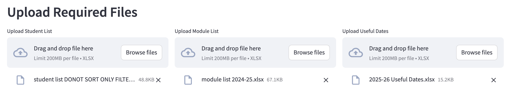
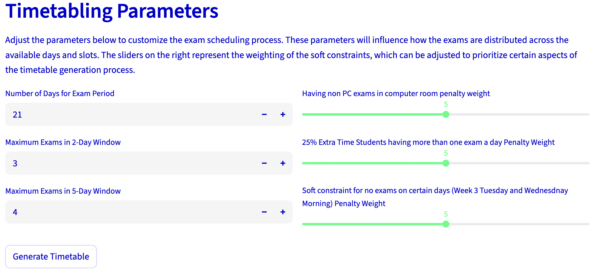

# Streamlit app

Owner: Edward Brady

With a working timetable algorithm it needs to be developed in an easy to use manner. In order to do this streamlit will be used for the UI as it is simple to use in python and only requires a couple changes from the current code. This app will allow the user to upload the neccesary files as well as edit the constraints and then download the generated excel sheet. It is based off the `complete_timetabler`Jupyter notebook.

Generate_timetable page

- Uploading file
    
    
    
    By having buttons to upload files it allows for an easy user experience and the necessary file can just be chose
    
- Adjustable parameters
    
    
    
    The hard constraints of how many exams in a 2 day and 5 day window can be changed and the weighting for the penalties of pc exams in computer rooms, 25% extra time students having more than 1 exam a day and no exams on week 3 Tuesday and Wednesday morning. The soft penalty multiplier is represented by multiplying in the minimise step.
    
    ```python
        model.Minimize(sum(spread_penalties) + sum(soft_day_penalties)*soft_day_penalty+   sum(extra_time_25_penalties)*extra_time_penalty+sum(room_surplus)+ sum(soft_slot_penalties)+ sum(non_pc_exam_penalty)*room_penalty)
      
    ```
    
    The weightings can go from 0x to 2x for the penalties.
    
- Storing the values across pages
    
    As there are three pages (home, generator and checker) some variables such as `days` need to be stored across all pages. This is done by using pickle . This occurs in the create  timetable function and at the end all the values are saved to a file in temporary storage
    
    ```python
            with open("exam_data.pkl", "wb") as f:
                pickle.dump({
                    "days": days,
                    "slots": [0, 1],
                    "exams": exams,
                    "AEA": AEA,
                    "leader_courses": leader_courses,
                    "extra_time_students_25": extra_time_students_25,
                    "extra_time_students_50": extra_time_students_50,
                    "student_exams": student_exams,
                    "exam_counts": exam_counts,
                    "Fixed_modules": Fixed_modules,
                    "Core_modules": Core_modules,
                    "rooms": rooms,
                    "exam_types": exam_types,
                }, f)
    ```
    
    Once back in the main scope they are added to streamlits session states
    
    ```python
    pickle_buffer.seek(0)
    data = pickle.load(pickle_buffer)
    #Unpack the data from the temporary pickle file and write it to session state to carry across pages
    st.session_state["exam_data"] = data
    ```
    

Check_timetable page

- Unpacking data
    
    For the second checking page the data needs to be unpacked from the session state, to do this we simply just assign it to variables.
    
    ```python
    #Import data from the generate page in session state
    
    data = st.session_state.get("exam_data", None)
    
    if data is not None:
        # Unpack all variables
        days = data["days"]
        slots = data["slots"]
        exams = data["exams"]
        AEA = data["AEA"]
        leader_courses = data["leader_courses"]
        extra_time_students_25 = data["extra_time_students_25"]
        extra_time_students_50 = data["extra_time_students_50"]
        student_exams = data["student_exams"]
        exam_counts = data["exam_counts"]
        Fixed_modules = data["Fixed_modules"]
        Core_modules = data["Core_modules"]
        rooms = data["rooms"]
        exam_types = data["exam_types"]
    else:
        st.error("No exam data found. Please generate the timetable first.")
    ```